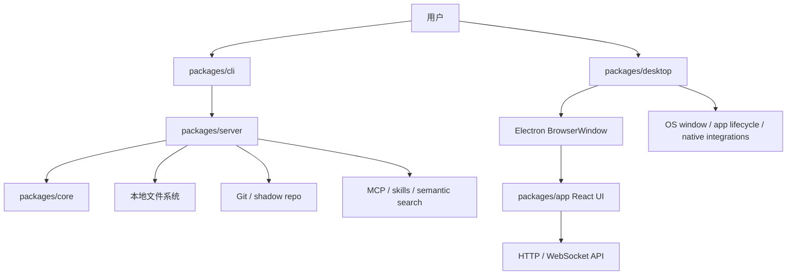

# 01. 架构地图：OpenKnowledge 的分层设计

## 1. 先给结论

OpenKnowledge 是一个“本地知识库 + 协作编辑 + AI Agent 工作台”，它的架构不是单一前端应用，而是一个多 package、分层式、运行时驱动的系统。

它的关键设计可以概括为：

- 前端：React UI，负责编辑器和交互层
- 运行时：Node server，负责文件/文档 API、Git、MCP、协作、search
- 桌面壳：Electron，负责窗口 / native / app lifecycle
- 领域层：core，负责 schema、协议、config、共享规则
- CLI：用户入口，负责启动 和 项目初始化

## 2. 精简的系统图

## 3. package 责任边界

### `packages/core`

这是“最底层的共享知识层”。它更偏业务数据模型 + 协议定义，而不是 UI 或 Node runtime。你可以把它理解为：

- schema / config / protocol / 常量 / 规则
- markdown 解析管线的抽象模型
- cross-process 和 browser/node 兼容的基础定义
- 共享的 domain vocabulary

典型入口：

- `packages/core/src/index.ts`
- `packages/core/src/config/...`
- `packages/core/src/commands/...`

如果你是前端开发者，第一次看到这个层时，应该把它当成“系统的语义总线”。它决定了：

- 配置字段长什么样
- 文档名是否合法
- sync mode 怎么定义
- 项目能力如何表达

### `packages/server`

这是整个系统最复杂、最关键的运行时层。

它承担：

- 启动核心 HTTP + WebSocket 服务
- 管理 document / project / watcher / persistence
- 执行 git / shadow repo / sync 逻辑
- 提供 API、MCP、skills 入口
- 处理 search / derived indexes / file ingestion

重点文件：

- `packages/server/src/server-factory.ts`
- `packages/server/src/boot.ts`
- `packages/server/src/index.ts`
- `packages/server/src/file-watcher.ts`
- `packages/server/src/persistence.ts`
- `packages/server/src/sync-engine.ts`

这里是最值得深入的代码层，尤其是你要理解“它为什么不仅是编辑器，而是一个本地知识工作台”。

### `packages/app`

这是用户真正看到的 React 编辑器和工作台界面。

它承担：

- 页面布局和导航
- 编辑器研发（Tiptap / CodeMirror / markdown preview 等）
- 文档 tab、folder tree、sidebar、search
- 配置与状态管理
- 大多数用户交互逻辑

重点文件：

- `packages/app/src/App.tsx`
- `packages/app/src/main.tsx`
- `packages/app/src/editor/DocumentContext.tsx`
- `packages/app/src/components/EditorPane.tsx`

如果你有 React 开发背景，这一层是你最容易进入的入口。它是理解“页面感”的地方。

### `packages/desktop`

Electron 桌面壳。它处理：

- BrowserWindow 创建和销毁
- app lifecycle
- window manager and attach model
- native menu / OS integration
- app-specific project bootstrap

重点文件：

- `packages/desktop/src/main/index.ts`
- `packages/desktop/src/main/window-manager.ts`
- `packages/desktop/src/main/bootstrap.ts`

这一层告诉你为什么它可以同时兼容：

- 桌面应用
- 本地 web UI
- 单文件 / 多项目 / attach 模式

### `packages/cli`

CLI 入口，负责：

- `ok init`
- `ok start`
- `ok ui`
- project init / share / diagnose / install integrations

重点文件：

- `packages/cli/src/index.ts`
- `packages/cli/src/commands/start.ts`
- `packages/cli/src/commands/init.ts`

这层是产品最“可用”的入口；它也通常最容易理解“用户的操作路径”。

## 4. 关键的架构事实：它不是单纯的前端

OpenKnowledge 设计上非常强调“本地工作区 + 持久化 + 协作 + Git”。因此一条典型链路是：

1. 用户打开项目目录
2. desktop 或 cli 启动 server
3. server 读取内容目录、git 信息、config
4. app 连接到 server 的 HTTP / WebSocket API
5. 文档内容在编辑器中更新
6. 变更被写回本地内容 + shadow repo + derived index
7. watch / sync / persistence 层维护一致性

这意味着：

- 只读 UI 不够，必须理解文件系统与状态管理
- 纯 React 组件并不是系统核心
- 运行时 consistency 是系统设计的重心

## 5. 你需要优先掌握的 5 个概念

### 5.1 Server 生命周期

`createServer` / `bootServer` 本质上是“系统核心启动器”。你要看它如何：

- 按项目目录创建 server instance
- 动态注册 API
- 安装 watcher
- 准备 state / config / git / skills

### 5.2 Document lifecycle

文档不是单纯 DB record，而是：

- file-system 中的 markdown 文件
- in-memory doc model
- YDoc / collaboration state
- derived index / backlinks / asset refs / search index

它是一个“多层表示”的对象。

### 5.3 Watcher + persistence

`file-watcher` 和 `persistence` 决定了：

- 本地文件变化如何被观测和流向应用
- 用户编辑如何被落盘
- 冲突如何被识别和恢复

这是很多复杂 bug 的核心。

### 5.4 Git / shadow-repo

OpenKnowledge 把 Git 做成基础能力，不是附加功能。系统将其用于：

- 版本控制
- remote sync / share
- project branch / preservation / restore
- managed artifact / state safety

### 5.5 AI / MCP / skills integration

这不是“前端挂个按钮”，而是有一整套 server-side agent integration。重点在于：

- `MCP` 入口
- agent session
- tools and skill bundles
- semantic search and knowledge graph

## 6. 一个最实用的阅读原则：按“控制流”读代码

不要一开始就从分页 UI 读起。更好的方式是：

1. 启动入口
2. server 创建
3. collab / API 接通
4. editor UI 连接
5. doc watcher / persistence
6. agent / skill / share 之类扩展

这样你的理解会更稳定。

## 7. 你应该在第一轮阅读后得到的结论

第一轮之后，你至少应该能回答：

- 哪些 package 是前端，哪些是 runtime，哪些是 native shell
- `server` 是真正的系统中枢
- `core` 负责共享语义和协议
- `desktop` 是 window lifecycle 和 native integration
- `app` 是 UI layer，但不是整个产品的本体

## 8. 下一步建议

继续阅读：

- [02-react-ui-layer.md](./02-react-ui-layer.md)
- [03-core-server-runtime.md](./03-core-server-runtime.md)
- [04-desktop-electron-and-cli.md](./04-desktop-electron-and-cli.md)
- [05-learning-plan.md](./05-learning-plan.md)

这几个文档分别按“UI、runtime、Electron/CLI、学习计划”展开。
