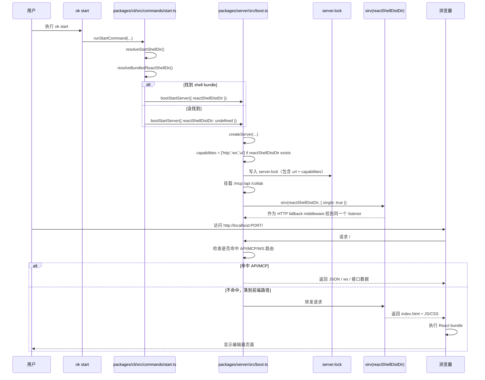

# 06. `ok start` 的启动链路：为什么有了 `ui` 能力后，访问 URL 就能显示编辑器？

本文整理前面的源码阅读结论，重点解释：

- `ok start` 在做什么
- `server.lock` 和 `capabilities` 的作用
- `ui` 能力是如何被写入的
- 为什么浏览器访问 URL 后会看到编辑器页面
- `sirv` 在这条链路里具体负责什么

---

## 1. 结论先行

这条链路里，最重要的区分是：

- `capabilities: ["ui"]` 表示“这个服务实例具备 UI 能力”
- `sirv(...)` 才是“把编辑器前端真正提供给浏览器”的代码

因此，`ui` 能力本身并不直接渲染页面；它只是一个能力声明，供锁/发现/复用逻辑识别。

真正显示编辑器页面的，是底层 HTTP listener 上挂载的 React shell static middleware。

---

## 2. 启动入口：`ok start` 是怎么进来的

CLI 入口在：

- [packages/cli/src/cli.ts](../packages/cli/src/cli.ts)

启动命令最终会靠：

- [packages/cli/src/commands/start.ts](../packages/cli/src/commands/start.ts)

这份代码里，真正的关键动作包括：

1. 判断当前项目是否能找到前端 shell bundle
2. 决定 `reactShellDistDir` 是否存在
3. 调用 `bootStartServer(...)`
4. 把 `reactShellDistDir` 传入 server boot 流程

---

## 3. shell 目录怎么判断

在 [packages/cli/src/commands/start.ts](../packages/cli/src/commands/start.ts) 里，启动流程会调用：

- `resolveStartShellDir(...)`
- `resolveBundledReactShellDir()`

它的逻辑大致是：

- 优先使用显式传入的 `--react-shell-dist-dir`
- 如果没有显式目录，再看是否是 `--only server`
- 否则尝试解析内置的 bundled shell 目录

如果找到了前端 bundle，说明当前实例能提供 UI；如果没有，就退化成 API/MCP-only 的服务。

从这里可以理解：

- “是否有 UI”不是某个随机判定
- 而是由“是否能解析到 shell dist 目录”决定

---

## 4. `ui` 能力是在哪里写进去的

真正写入能力字段的地方在：

- [packages/server/src/boot.ts](../packages/server/src/boot.ts)

关键代码逻辑是：

```ts
capabilities: opts.reactShellDistDir ? ['http', 'ws', 'ui'] : ['http', 'ws']
```

这行代码的含义非常直接：

- `reactShellDistDir` 存在 => 当前 server 具备 UI 能力
- `reactShellDistDir` 不存在 => 只是 HTTP + WS 能力，不带 UI

也就是说：

- `ui` 是“能力声明”
- 它来自于“当前进程确实在提供前端 shell”

---

## 5. `server.lock` 是怎么写入的

`server.lock` 是项目启动时的运行时发现元数据文件，用来记录当前 server 实例的信息。

实现位于：

- [packages/server/src/server-lock.ts](../packages/server/src/server-lock.ts)
- [packages/server/src/process-lock.ts](../packages/server/src/process-lock.ts)

真正写文件的逻辑在 `process-lock.ts`：

- `openSync(lockPath, 'wx', 0o600)`
- `writeSync(fd, payload)`
- `JSON.stringify(record, null, 2)`

这意味着：

- 每次启动时，会把当前端口、URL、capabilities、pid 等信息写进 lock
- 后续再启动时，如果发生冲突，可以读取这个 lock，判断当前实例是否已经在运行

其中最关键的是：

- `capabilities` 里是否包含 `ui`
- `url` 是否存在

这决定了“这台 server 是不是浏览器/编辑器入口”。

---

## 6. 为什么浏览器访问 URL 就能显示编辑器页面

这里真正决定页面显示的是前端 shell 的 HTTP 挂载，不是 `capabilities` 本身。

关键代码位于：

- [packages/server/src/boot.ts](../packages/server/src/boot.ts)

```ts
const reactShellMiddleware = opts.reactShellDistDir
  ? sirv(opts.reactShellDistDir, {
      single: true,
      gzip: true,
      etag: true,
      dev: true,
    })
  : undefined;
```

`sirv` 是一个静态文件中间件，它负责：

- 读取前端 bundle 的静态资源
- 返回 `index.html`
- 对 SPA 路由做回落
- 让浏览器可以加载 React 前端

其中 `single: true` 很关键：

- 当请求不是静态文件，而是前端路由时
- `sirv` 会自动回到 `index.html`
- 浏览器拿到这个入口页面后，再执行 JS bundle
- 页面最终就渲染成编辑器 UI

因此：

> `capabilities` 解决的是“这个实例是不是 UI-capable 的发现/广告问题”；
> `sirv` 解决的是“浏览器请求 URL 时，是否真的返回编辑器页面”。

---

## 7. 这条完整链路



---

## 8. 一句话总结：`ui` 能力和页面显示的关系

可以把它理解成：

- `ui` 能力 = “说明当前实例能提供编辑器入口”
- `sirv` = “真正把编辑器入口交付给浏览器”

所以，如果你看到 `server.lock` 里有 `capabilities` 包含 `ui`，那就说明这个 server 对外宣称自己是 UI 入口；真正让浏览器渲染出编辑器页面的，还是 `sirv` 挂在同一监听端口上的 React shell middleware。

---

## 9. 对后续学习的建议

如果后面继续深入，建议关注下面几条线：

1. `resolveStartShellDir`：UI 是否存在的判定入口
2. `capabilities`：锁/复用/发现协议上的能力表达
3. `sirv`：真正的静态资源与 SPA 入口服务
4. `server.lock`：运行态发现、重用与冲突处理

这四者组合起来，就能完整理解“为什么访问一个 URL，就能进入编辑器页面”。

---

## 10. 关键文件索引

- [packages/cli/src/cli.ts](../packages/cli/src/cli.ts)
- [packages/cli/src/commands/start.ts](../packages/cli/src/commands/start.ts)
- [packages/server/src/boot.ts](../packages/server/src/boot.ts)
- [packages/server/src/server-lock.ts](../packages/server/src/server-lock.ts)
- [packages/server/src/process-lock.ts](../packages/server/src/process-lock.ts)

这几处文件是这条链路最核心的代码位置。
