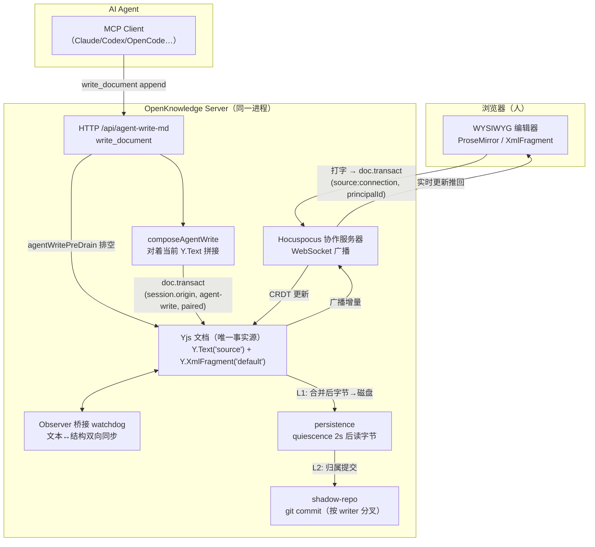
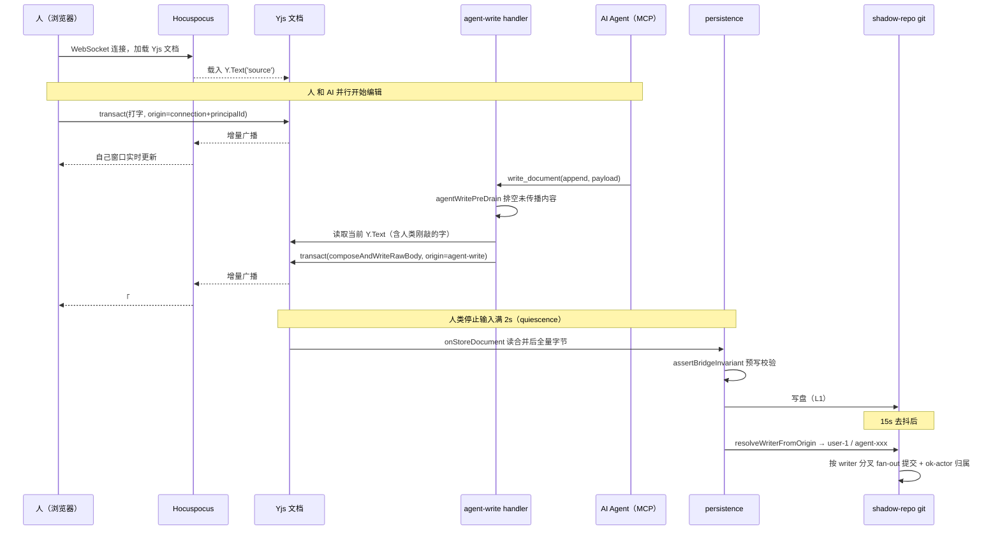

# 07. 人机双写同一文档的原理与完整示例

> 目标：理解 OpenKnowledge 为什么能支持**人类（浏览器 WYSIWYG）和 AI Agent（MCP/HTTP）同时编辑同一个文档**，以及它背后的完整数据流。
> 前置阅读：`03-core-server-runtime.md`、`01-architecture-map.md`。

## 1. 一句话结论

人和 AI 不是各自改文件再合并，而是**共同写入同一份内存中的 Yjs CRDT 文档（Y.js）**，只有一个事实源。CRDT 保证并发收敛，落盘只发生在 quiescence（写入骤歇）之后，git 只负责记录"谁在什么时候写了什么"。

## 2. 核心模型：每个文档 = 一份 Yjs 文档，含两个同步结构

- `Y.Text('source')` —— 原始 markdown 源码字节，是**真相源**（precedent #38，Y.Text-is-truth）。
- `Y.XmlFragment('default')` —— WYSIWYG / ProseMirror 结构，从 Y.Text 派生。

两者都在同一个 server 进程里，靠观察者桥接保持同步（`packages/server/src/bridge-watchdog.ts` 里的 Observer A/B）。

### 三个写入入口都落到这同一份 Yjs 文档

| 写入方 | 通道 | transaction origin |
| --- | --- | --- |
| 人（浏览器） | WebSocket → Hocuspocus 协作服务器 | `source: 'connection'` + principalId |
| AI Agent | MCP → HTTP `/api/agent-write-md` → `applyAgentMarkdownWrite` | `source: 'local'` + 每会话冻结的 `session.origin`（agent-write，paired） |
| 外部磁盘编辑 | file watcher | `file-watcher` |

- 浏览器 WYSIWYG 通过 Hocuspocus WebSocket 订阅同一份 Yjs 文档（`packages/server/src/collaboration-host.ts`），人的敲击是 `Y.Doc.transact(..., connectionOrigin)`。
- Agent 写入在 `packages/server/src/agent-sessions.ts` 的 `applyAgentMarkdownWrite` 中执行。

## 3. 为什么不会互相覆盖

- **CRDT 语义**：Yjs 对同一位置的并发插入 / 删除做排序合并，两个写入方永远收敛到同一最终状态，不需要文件锁或"最后写入者赢"。
- **单线程 JS**：事务、`encodeStateVector`、序列化都是同步执行，不会交错（`persistence.ts` 中有专门注释强调）。
- **增量保留**：`patch`（AI 的 edit 查找替换）故意走 item-preserving 的增量 primitive（`composeAndWriteRawBody`，DMP 增量），而不是全量重写，把并发编辑的"残留面"缩到最小。

## 4. 完整双写示例（时间线）

**场景**：人类在浏览器里编辑 `docs/auth.md` 的同时，Claude agent 通过 MCP 对同一文档调用 `write_document`（append 一段建议）。

初始状态 `auth.md`：

```markdown
# Auth 方案

**现状**：无 token 刷新。
```

| 时刻 | 谁 | 动作 | 内部发生了什么 |
| --- | --- | --- | --- |
| T0 | 浏览器 | 打开文档 | 经 WebSocket 连上 Hocuspocus，加载 Yjs 文档，`Y.Text('source')` 载入当前字节 |
| T+50ms | **人** | WYSIWYG 里输入「token 刷新有 race 问题。」 | 触发 `doc.transact(fn, {source: 'connection', principalId: 'user-1'})`；Y.Text 更新，XmlFragment 同步，增量广播给其他连接 |
| T+80ms | **AI** | MCP 调 `write_document`，position=`append`，payload=`## 建议\n\n引入 refresh token 轮换。` | HTTP handler 收到 → `agentWritePreDrain` 先排空未传播的 WYSIWYG 内容 → `applyAgentMarkdownWrite` |
| T+80ms | AI 写入核心 | | `composeAgentWrite` 读取**当前** Y.Text（此刻已含人类刚输入的内容）→ 拼接 `currentBody + "\n\n" + payload` → 在 `doc.transact(fn, session.origin)` 内走 DMP 增量 primitive `composeAndWriteRawBody`（item-preserving，只动最小差异）→ `parse(body)` + `updateYFragment` 更新 XmlFragment |
| T+120ms | 浏览器 | 收到 agent 的 CRDT 增量 | 「## 建议」章节实时出现；用户在别处继续打字不受影响，两处并发编辑在 Yjs 内自动收敛 |
| T+2.1s | server | 人停止输入满 2s（quiescence gate） | `onStoreDocument` 触发：读 Y.Text 合并后全量字节 → `assertBridgeInvariant` 预写校验 → `tracedWriteFile` 原子写盘（L1，CRDT→磁盘） |
| T+~17s | server | git 去抖 15s 到期 | `resolveWriterFromOrigin` 识别两个事务分别来自 `user-1` 和 `agent-<connId>`，shadow repo 按 writer **分叉 fan-out 提交**，`ok-actor` 记录归属 |

> 若两者恰好改了**同一区域**：CRDT 仍能合并，但 `applyAgentMarkdownWrite` 事务内会逐字节比对 Y.Text 与 AI 意图内容；不一致时返回 `content-divergence` 警告并附当前实际状态，AI 据此重新读文档再继续。

## 5. 流程图



## 6. 时序图（带归属判定）



## 7. 架构澄清：Hocuspocus 不是独立服务

Hocuspocus **不是独立部署的服务，而是和 OpenKnowledge server 跑在同一个 Node 进程里**——只有一个实例、一份 Yjs 文档空间。

关键证据：

- **进程内实例化**：`packages/server/src/server-factory.ts` 里 `hocuspocus = new Hocuspocus({ debounce, maxDebounce, extensions: [persistence.extension] })`，发生在 `createServer` 内部，和 HTTP / MCP / watcher / persistence / git 同进程。
- **同一端口、同一 HTTP server**：`packages/server/src/collaboration-host.ts` 的 WebSocketServer 是 `noServer: true`，通过 `handleUpgrade` 挂到同一个 HTTP server 上——collab WebSocket、`/api/*`、`/mcp`、web UI 共用默认 24550 端口，没有额外的端口或进程。
- **Agent 甚至不走 WebSocket**：`packages/server/src/agent-sessions.ts` 用的是 `hocuspocus.openDirectConnection(docName, sessionContext)`——进程内的 DirectConnection，直接连到同一个 Hocuspocus 实例的 Yjs 文档对象。所以 Agent 写和浏览器敲字操作的是**同一批内存中的 Y.Doc**，完全共享。

一句话总结：**一个 Hocuspocus 实例，两种传输**——浏览器走 WebSocket，Agent 走进程内 DirectConnection（系统文档、config 文档也走这种直连）。

这也是为什么 `resolveWriterFromOrigin` 能靠 origin 区分：两者都落在同一 Hocuspocus 上，只是事务的 origin 来源不同（`connection` vs `local`）。

## 8. 一致性兜底与归属落盘

### 一致性兜底

- **content-divergence 检测**：事务内读回 Y.Text，与实际 payload 逐字节对比；不一致（并发对端残留或 primitive 回归）就返回警告，提示 AI 重新读文档。
- **quiescence gate**：落盘有 2s 去抖（上限 10s），等写入骤歇才读 Y.Text 写盘，避免写到一半的中间态。
- **git 合并冲突**是另一层：GitHub 同步下的 merge-conflict 文档会拒绝所有写操作（409 `doc-in-conflict`），走 `conflicts` + `resolve_conflict` 流程，而不是被 CRDT 静默吞掉。

### 归属与落盘

- 落盘分两层：`onStoreDocument`（CRDT → 磁盘，写 Y.Text 原字节）和 debounce 15s 的 shadow-repo git 提交。
- **归属靠事务 origin 判别**（`packages/server/src/persistence.ts` 的 `resolveWriterFromOrigin`）：`connection` + principalId → 人类身份；`local` + session_id → `agent-<connId>`。随后按 writer 分别 fan-out 提交，所以历史里能看出"这段是你改的、那段是 agent:claude 改的"。

## 9. 阅读源码时值得抓住的关键点

1. `packages/server/src/agent-sessions.ts` —— `applyAgentMarkdownWrite`（agent 写入核心）、`composeAgentWrite`（对着当前 Y.Text 拼接）、`agentWritePreDrain`（写前排空）。
2. `packages/server/src/persistence.ts` —— `onStoreDocument`（L1 落盘）、`resolveWriterFromOrigin`（归属判别）、quiescence 去抖。
3. `packages/server/src/collaboration-host.ts` —— Hocuspocus WebSocket 协作主机，浏览器连接的入口。
4. `packages/server/src/sync-engine.ts` —— 协作状态 / agent writes / conflict handling。
5. `packages/server/src/bridge-watchdog.ts` —— Y.Text 与 XmlFragment 的桥接同步。

## 10. 核心要点回顾

- 人和 AI 永远不直接改磁盘文件，而是改**同一份内存 Yjs 文档**。
- CRDT 保证并发收敛，增量 primitive 保证最小冲突面。
- 落盘只发生在 quiescence 之后，git 只负责记录"谁在什么时候写了什么"。
